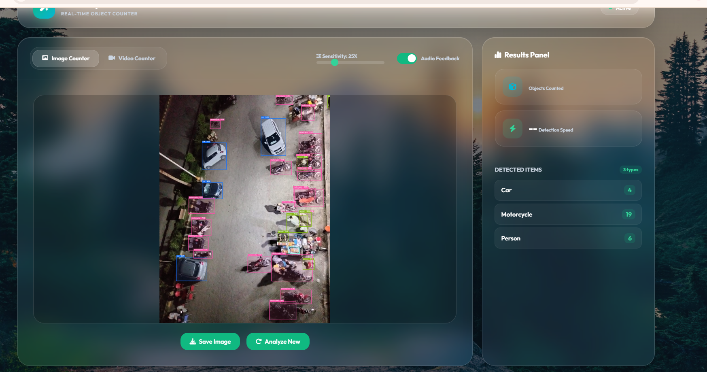
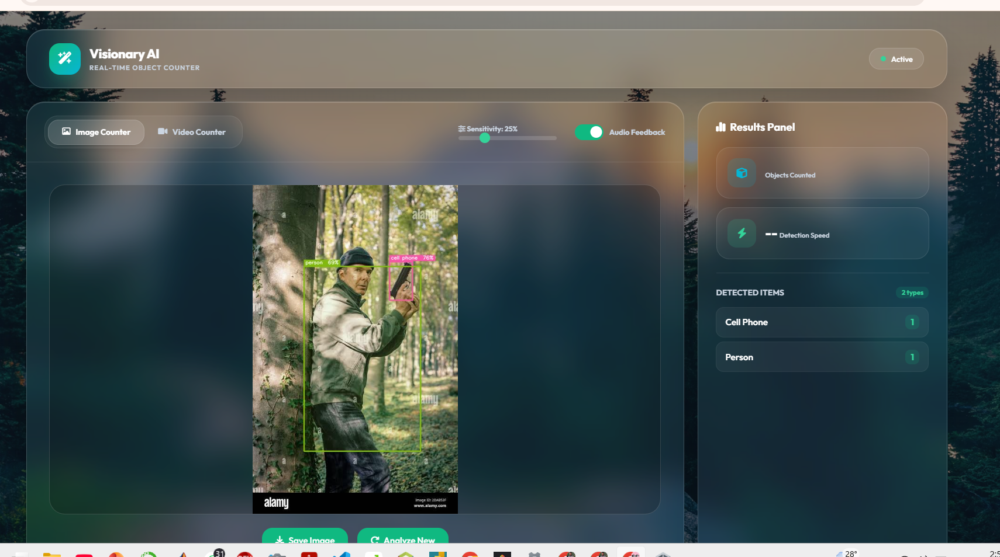
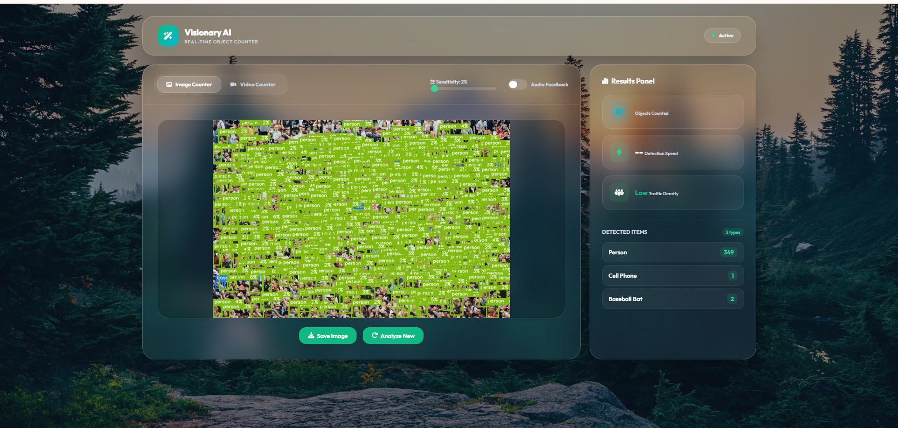
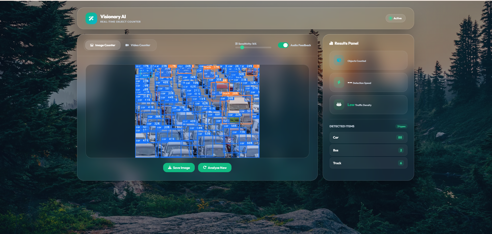

# Visionary AI - Real-Time Object Detector 👁️✨


A premium, glassmorphic real-time object detection and counting system powered by **YOLOv11**. Designed to handle high-density crowd counting, heavy traffic monitoring, and robust real-time media streams with extreme accuracy.

## 📸 Screenshots


<div align="center">
  
  
  
  
</div>

## 🚀 Features

- **Multi-Media Support:** Upload static images, process local MP4/M4V video files, or use a live webcam stream.
- **YOLOv11 Powered:** Uses the state-of-the-art `yolo11l.pt` (Large) model for extreme accuracy in highly dense environments.
- **Real-Time Analytics:** 
  - Tracks the **total number of objects** detected.
  - Dynamically calculates **Traffic / Crowd Density** (Low, Medium, High).
  - Identifies the **Main Subject (Dominant Object)** in the scene.
- **Lag-Mitigated Streaming:** Video streaming inference is dynamically optimized to reduce latency and provide a smooth overlay.
- **Premium UI/UX:** A stunning, responsive Glassmorphism design with interactive animations and a professional results dashboard.
- **Dynamic Audio Feedback:** Beeps and notifications when objects are detected (can be toggled).

## 🛠️ Installation

1. **Clone the repository:**
   ```bash
   git clone https://github.com/malikmajid161/Visionary-AI-Detector.git
   cd Visionary-AI-Detector
   ```

2. **Set up a Virtual Environment (Optional but recommended):**
   ```bash
   python -m venv venv
   source venv/bin/activate  # On Windows: venv\Scripts\activate
   ```

3. **Install Dependencies:**
   ```bash
   pip install -r requirements.txt
   ```

4. **Model Setup:**
   The backend uses `models/yolo11l.pt`. If it is not present, the system will automatically download it on the first run. 

## 💻 Usage

Run the FastAPI backend using Uvicorn:

```bash
python -m uvicorn main:app --host 127.0.0.1 --port 8000
```

Open your browser and navigate to:
👉 **http://127.0.0.1:8000**

### User Interface Controls
- **Sensitivity Slider:** Adjust the confidence threshold (e.g., 25%) to filter out false positives.
- **Tabs:** Switch seamlessly between **Image**, **Video Upload**, and **Webcam**.
- **Analyze New / Stop:** Instantly halt media processing or clear the canvas for a new analysis.

## 📂 Repository Structure

```text
Visionary-AI-Detector/
│
├── models/                  # YOLOv11 Model weights (.pt files)
├── static/                  # Frontend Assets
│   ├── index.html           # Main UI structure
│   ├── style.css            # Glassmorphism styling & animations
│   └── script.js            # WebSocket, WebRTC, and API logic
│
├── main.py                  # FastAPI Backend server
├── requirements.txt         # Python dependencies
└── README.md                # Project documentation
```

## 🤝 Contributing
Contributions are welcome! Please feel free to submit a Pull Request.

## 📝 License
This project is open-source and available under the [MIT License](LICENSE).
